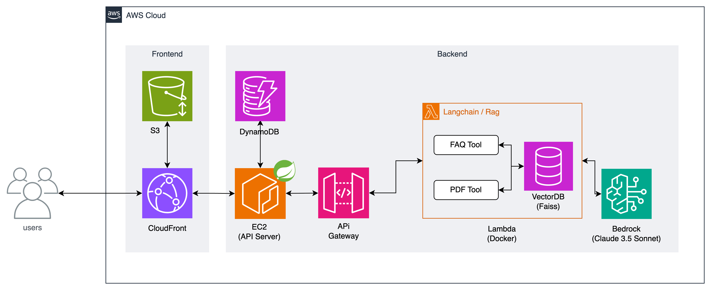
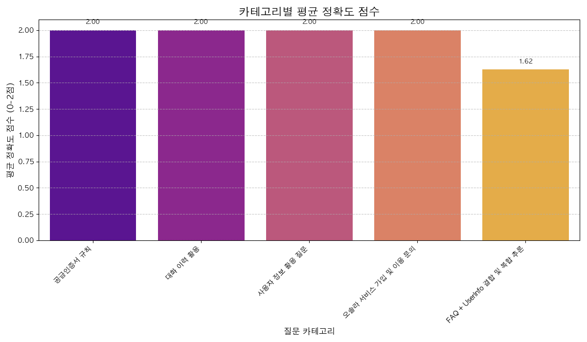
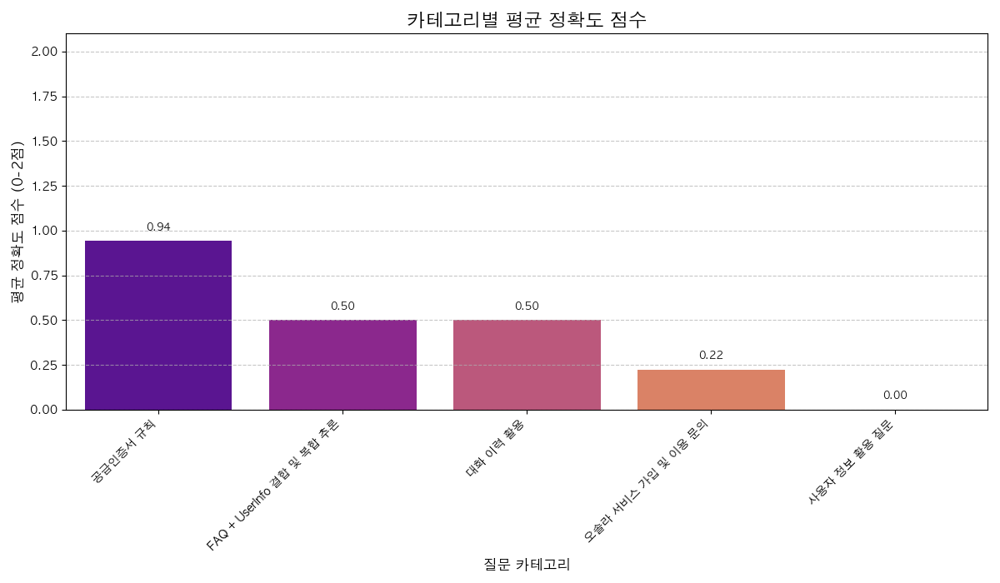

# Soly - Renewable Energy CS Chatbot

Soly is an AI-powered customer service chatbot specialized in the renewable energy domain that automatically handles customer inquiries.
It leverages Retrieval-Augmented Generation (RAG) and large language models (LLMs) to search the knowledge base in real time and generate accurate answers.

## 🚀 Overview

- Responds to customer inquiries in natural language

- Searches knowledge based on embeddings of internal FAQs and policy documents
- Provides streaming responses for real-time interaction

## 🛠️ Stack

- Python
- AWS Lambda / API Gateway (Socket) / ECR
- LangChain, RAG, FAISS
- Amazon Bedrock, Titan Embedding, Claude Sonnet
- Docker, Poetry, LangSmith

## ⚡ Install

### 1️⃣ clone

```bash
git clone https://github.com/seoyeonjin/rag-chat-bot.git
cd rag-chat-bot
```

### 2️⃣ poetry install

```bash
poetry install
```

### 3️⃣ run

- An AWS account must be properly configured, as Bedrock is called internally.

```bash
poetry run uvicorn soly_core.main:app --reload
```

### or Docker build

```bash
docker build -t soly-chatbot .
docker run -p 8000:8000 soly-chatbot
```

## 📂 Project Architecture



## 📝 Evaluation

We evaluated Soly using two key performance metrics: response accuracy and response time.

### 1️⃣ Response Accuracy

Response accuracy was assessed based on manual grading of 46 real user queries. Each response was scored on a 3-point scale:

- **0 points**: Response irrelevant to the question
- **1 point**: Response with inaccurate or insufficient information
- **2 points**: Response that provides accurate information relevant to the question

Both RAG-based responses and LLM-only responses were evaluated side by side for correctness and completeness.

📌 **Results**

<p align="center">
  
  
</p>

- **RAG-based responses** achieved an average score of **1.93**, providing accurate domain-specific answers in most cases.
- **LLM-only responses** scored an average of **0.50**, often generating irrelevant or abstract answers.

Common issues found in LLM-only responses:

1. Lack of domain context understanding
   Example: When asked about REC (Renewable Energy Certificate) trading, Claude 3.5 Sonnet misunderstood REC as "Record" and generated irrelevant answers.
2. Failure to reflect company policies and regulations
   LLM-only responses did not incorporate the company’s actual operational policies or terminology, relying solely on pre-trained general knowledge.

These results demonstrate that the RAG architecture, by providing external document-based context, enables accurate and reliable responses tailored to the solar energy domain. Especially for domain-specific terms such as "settlement/contract," "grid connection," and "supply certificate," RAG significantly outperformed LLM-only responses.

---

### 2️⃣ Response Time

Response latency was measured to evaluate the chatbot’s real-time capability and perceived responsiveness. Based on LangSmith logs:

- **P50 (median)**: 7.40 seconds
- **P99 (99th percentile)**: 14.47 seconds

This indicates that most queries were processed within 7 seconds, with even outlier cases completing within 15 seconds.

---

### Summary

The evaluation highlights that RAG-based architectures are highly effective for delivering accurate, policy-compliant responses in specialized domains such as solar power. By leveraging document-based context, RAG minimizes hallucinations and ensures consistency with industry standards and internal policies.

## 📌 Project Information

- Developer: Individual (solo project)
- Development period: April 2025 – June 2025
